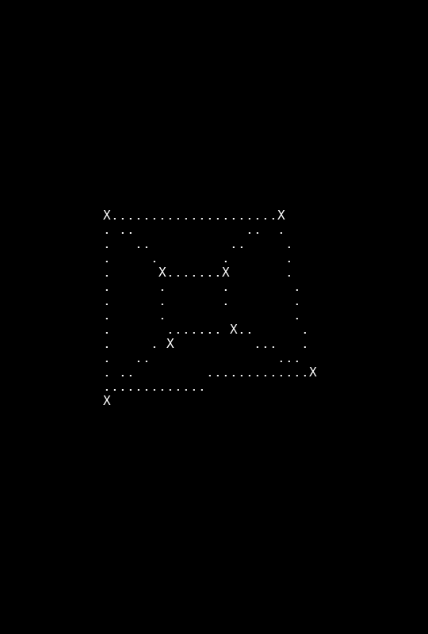
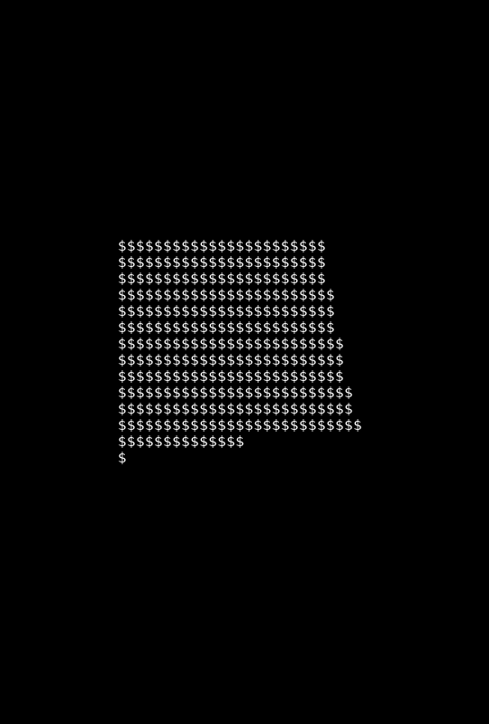

# Rotating Cube

This project is a console application inspired by the [Spinning Cube](https://youtu.be/p09i_hoFdd0) by *Code Fiction*. I implemented my interpretation of a spinning ASCII Cube in C. As a twist I added the option to only show the vertices and edges of the cube.

## Documentation

A complete documentation can be found at

...

## Animation

Vertices, Edges and Faces are drawn independently.

The cube supports two modes which can be changed in function `void draw_cube(String* cnv, Cube* c)` in the `cube.c` file.

### Cube with Vertices and Edges drawn

### Cube with Edges drawn

